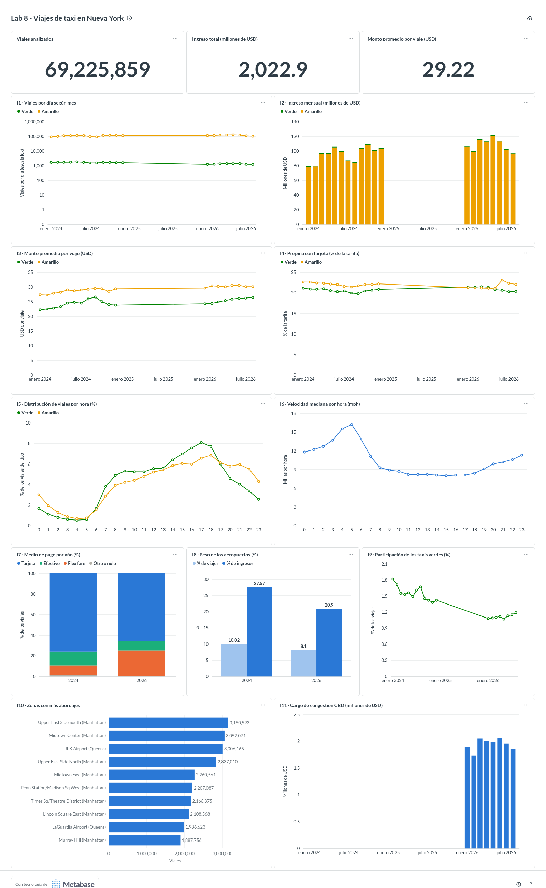

# Ejercicio 7 — Indicadores y tablero

Tablero construido en **Metabase** (la herramienta del ambiente) sobre la base
materializada `data/processed/taxi.duckdb` del Ejercicio 6, que en este punto
contiene 2024 (12 meses) y 2026 (enero a agosto).

- Consultas de los indicadores: [sql/07_indicators/](../sql/07_indicators/).
- Código que crea la conexión, las tarjetas y el tablero:
  [scripts/metabase_dashboard.py](../scripts/metabase_dashboard.py).
- Evidencia: captura [07_dashboard/dashboard_2024_2026.png](07_dashboard/dashboard_2024_2026.png)
  y definición exportada [07_dashboard/dashboard.json](07_dashboard/dashboard.json)
  (nombre, pregunta, tipo de gráfica, SQL y posición de cada tarjeta).



## Cómo se construyó

1. Metabase se conecta a DuckDB con el driver incluido en la imagen, apuntando a
   `/workspace/data/processed/taxi.duckdb` en modo `read_only` (un archivo
   `.duckdb` admite un solo escritor, y así el servicio `lab` puede seguir
   leyéndolo).
2. Cada indicador es una **pregunta nativa** de Metabase cuyo SQL es exactamente
   el archivo de `sql/07_indicators/`; la consulta se ejecuta en DuckDB y Metabase
   solo dibuja el resultado.
3. `scripts/metabase_dashboard.py` crea (o actualiza, si ya existen) la base de
   datos en Metabase, la colección «Lab 8 - Taxis NYC», las 14 tarjetas y el
   tablero «Lab 8 - Viajes de taxi en Nueva York», ejecuta cada tarjeta para
   comprobar que no falla y exporta la definición. Usa la API de Metabase con una
   API key guardada en `.env` (excluido de Git):

   ```bash
   docker compose exec lab python scripts/metabase_dashboard.py --public
   ```

Hacerlo por código y no a mano permite reconstruir el tablero en cualquier
instalación de Metabase y actualizarlo cuando cambian los datos (Ejercicio 8).

## 7.1 Preguntas de análisis

| # | Pregunta |
|---|---|
| P1 | ¿Qué volumen total de viajes, ingreso y monto promedio describe el conjunto de datos? |
| P2 | ¿Cómo evoluciona la demanda diaria de cada tipo de taxi a lo largo de los meses? |
| P3 | ¿Cuánto ingreso genera cada mes y cuánto aporta cada tipo de taxi? |
| P4 | ¿Está subiendo lo que paga un pasajero por viaje? |
| P5 | ¿Qué tan generosas son las propinas con tarjeta y cambian con el tiempo? |
| P6 | ¿En qué horas se concentra la demanda de cada tipo de taxi? |
| P7 | ¿A qué horas el tráfico hace más lentos los viajes? |
| P8 | ¿Cómo pagan los pasajeros y está cambiando la forma de pago? |
| P9 | ¿Qué parte de los viajes y del ingreso viene de los aeropuertos? |
| P10 | ¿Están perdiendo terreno los taxis verdes frente a los amarillos? |
| P11 | ¿Dónde se originan más viajes? |
| P12 | ¿Cuánto recauda el cargo de congestión de Manhattan desde que existe? |

## 7.2 a 7.7 Indicadores

| Tarjeta | Pregunta | SQL | Visualización | Justificación |
|---|---|---|---|---|
| Viajes analizados, Ingreso total, Monto promedio | P1 | `01_kpi_summary.sql` | 3 números (KPI) | Dan la escala del conjunto antes de leer las tendencias. |
| I1 Viajes por día según mes | P2 | `02_trips_per_day.sql` | Líneas por tipo, eje logarítmico | Normaliza por días con actividad para comparar meses de distinta duración; el eje logarítmico permite ver en una sola escala dos series que difieren 70 veces. |
| I2 Ingreso mensual | P3 | `03_monthly_revenue.sql` | Barras apiladas por tipo | El ingreso es una suma, así que apilar muestra el total y la aportación de cada tipo. |
| I3 Monto promedio por viaje | P4 | `04_avg_ticket.sql` | Líneas por tipo | Separa el efecto precio del efecto volumen en el ingreso. |
| I4 Propina con tarjeta | P5 | `07_tip_pct.sql` | Líneas por tipo | Solo los pagos con tarjeta registran propina; como % de la tarifa es comparable entre viajes de distinto costo. |
| I5 Distribución por hora | P6 | `05_hourly_demand.sql` | Líneas por tipo (% del tipo) | Usar porcentajes compara la forma del día aunque los volúmenes sean muy distintos. |
| I6 Velocidad mediana por hora | P7 | `10_speed_by_hour.sql` | Línea | La mediana (aproximada, `approx_quantile`) es robusta a los atípicos de velocidad del Ejercicio 4 y mide la congestión. |
| I7 Medio de pago por año | P8 | `06_payment_mix.sql` | Barras apiladas al 100 % | Composición: cada barra suma 100 % de los viajes del año. |
| I8 Peso de los aeropuertos | P9 | `08_airport_share.sql` | Barras agrupadas (% viajes y % ingresos) | Poner ambos porcentajes juntos muestra el desbalance entre volumen e ingreso. |
| I9 Participación de los taxis verdes | P10 | `11_green_share.sql` | Línea | Una proporción elimina la estacionalidad común a ambos tipos. |
| I10 Zonas con más abordajes | P11 | `09_top_zones.sql` | Barras horizontales | Ranking con nombres largos de zona: las barras horizontales los dejan legibles. |
| I11 Cargo de congestión CBD | P12 | `12_cbd_fee.sql` | Barras por mes | El cargo es un monto mensual recaudado; los meses sin cargo quedan en cero. |

Todas las consultas leen la vista `trips_clean` (o la tabla `zones`) de
`taxi.duckdb`. Ejemplo, I1:

```sql
SELECT
    make_date(source_year, source_month, 1) AS month,
    taxi_type,
    round(count(*) / count(DISTINCT CAST(pickup_datetime AS DATE)), 0) AS trips_per_day
FROM trips_clean
GROUP BY ALL
ORDER BY month, taxi_type;
```

El SQL de cada tarjeta también queda en `docs/07_dashboard/dashboard.json`.

## 7.8 Interpretación

| Indicador | Resultado | Interpretación |
|---|---|---|
| KPI | 69,225,859 viajes válidos, 2,022.9 millones de USD, 29.22 USD por viaje | Escala de 20 meses de operación (2024 completo y enero a agosto de 2026). |
| I1 | Amarillos: entre 92,444 y 127,844 viajes diarios; verdes: entre 1,247 y 1,854 | Los amarillos de 2026 superan a los de 2024 en todos los meses comparables; ambos años caen en julio y agosto. |
| I2 | Amarillos: 78.4 a 120.9 millones de USD al mes; verdes: 0.9 a 1.4 | Los verdes aportan cerca del 1 % del ingreso. El ingreso sigue al volumen: los meses de verano son los más bajos. |
| I3 | Amarillos: 27.34 (enero 2024) → 30.10 (agosto 2026); verdes: 22.20 → 26.46 | El monto promedio sube en ambos tipos (+10 % y +19 %); 2026 incluye el cargo CBD de 0.75 USD. |
| I4 | 20 % a 23 % de la tarifa | Estable, con un salto en los amarillos desde junio de 2026 (21.1 % → 23.1 %), el mismo mes en que aparece la columna `request_source` (viajes pedidos por aplicación). |
| I5 | Pico de los verdes a las 17 h (8.1 % de sus viajes); de los amarillos a las 18 h (6.9 %) | Los amarillos conservan más actividad nocturna: a las 22 h tienen 5.5 % de sus viajes contra 3.4 % de los verdes. |
| I6 | Máximo de 16.2 mph a las 5 h; mínimo de 8.0 mph a las 15 h | De 11 a 17 h la velocidad mediana se mantiene en 8 mph: la ciudad está congestionada todo el día laboral, no solo en las horas pico. |
| I7 | Tarjeta 75.9 % → 65.6 %; flex fare 9.2 % → 24.4 %; efectivo 13.5 % → 9.2 % (2024 → 2026) | El cambio más grande del periodo es el crecimiento de los registros *flex fare* (`payment_type = 0`), que no informan el medio de pago. |
| I8 | 2024: 10.0 % de viajes y 27.6 % de ingresos; 2026: 8.1 % y 20.9 % | El aeropuerto pesa menos en 2026 porque crecieron más los viajes urbanos. |
| I9 | 1.82 % (enero 2024) → 1.42 % (diciembre 2024) → 1.08–1.19 % (2026) | Los verdes pierden participación de forma sostenida. |
| I10 | Upper East Side South, Midtown Center y JFK superan los 3 millones de abordajes | Ocho de las diez zonas están en Manhattan; las otras dos son JFK y LaGuardia. |
| I11 | 0 en 2024; entre 1.73 y 2.06 millones de USD al mes en 2026 (66 % a 76 % de los viajes) | El cargo de congestión, vigente desde enero de 2025, ya es un componente estable del ingreso. |

### Principales hallazgos

1. **Más viajes amarillos y menos verdes.** Los amarillos crecieron entre 2024 y
   2026 mientras la participación de los verdes cayó de 1.8 % a 1.1 %.
2. **Viajes más caros.** El monto promedio subió 10 % en los amarillos y 19 % en
   los verdes, en parte por el nuevo cargo de congestión (cerca de 2 millones de
   USD al mes).
3. **Cambio en el registro del pago.** Los viajes *flex fare* pasaron de 9 % a
   24 %, lo que reduce la proporción de viajes con información de pago y propina.
4. **Congestión durante todo el día laboral.** La velocidad mediana cae a 8 mph
   desde las 11 h y no se recupera hasta la noche.
5. **El aeropuerto concentra el ingreso.** Con 8–10 % de los viajes genera
   21–28 % del ingreso.

Las líneas de I1, I3, I4 y I9 unen diciembre de 2024 con enero de 2026 porque
todavía no se ha descargado 2025; ese hueco se completa en el Ejercicio 8.
