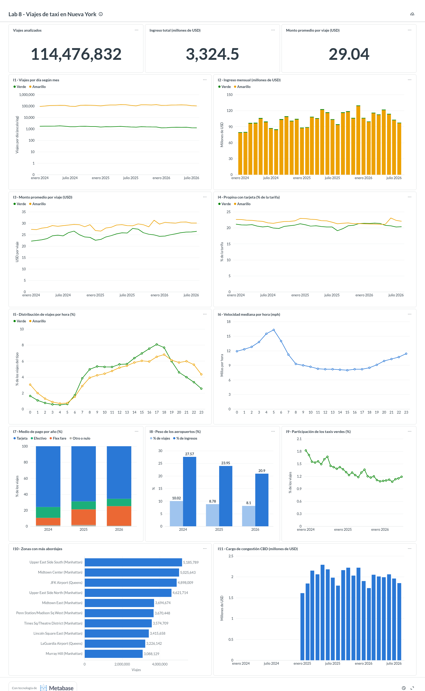

# Ejercicio 8 — Incorporación de 2025 y análisis completo

Notebook ejecutado: [notebooks/08_three_years.ipynb](../notebooks/08_three_years.ipynb).
Consultas nuevas: [sql/08_three_years/](../sql/08_three_years/).
Tablero actualizado: [07_dashboard/dashboard_2024_2025_2026.png](07_dashboard/dashboard_2024_2025_2026.png).

## 8.1 Cambio en el sistema de descarga

Igual que en el Ejercicio 5, bastó con una línea:

```diff
-DEFAULT_YEARS = (2024, 2026)
+DEFAULT_YEARS = (2024, 2025, 2026)
```

```bash
docker compose exec lab python scripts/download_data.py
docker compose exec lab python scripts/download_data.py --verify
```

```text
RESUMEN                                  RESUMEN (--verify)
  años          : 2024, 2025, 2026         descargados   : 0
  descargados   : 24                       ya existían   : 64
  ya existían   : 40                       verificados   : 64
  no publicados : 8                        incompletos   : 0
  fallidos      : 0                        fallidos      : 0
```

Se descargaron los 24 archivos de 2025 (12 amarillos de 56.4 a 74.2 MiB y 12
verdes de 1.1 a 1.3 MiB; 806 MiB en total) y los 64 archivos coinciden con el
tamaño publicado.

## 8.2 Sin descargas repetidas

Los 40 archivos de 2024 y 2026 aparecieron como «ya existe, se omite» y no se
consultó al servidor por ellos. La ejecución incluida en el notebook reporta
`descargados: 0` y `ya existían: 64`.

## 8.3 Las consultas siguen funcionando

Sin modificar ninguna consulta:

- Las **37 consultas** de los Ejercicios 3, 4 y 5 se ejecutaron sobre los tres
  años sobre Parquet directo: **37 de 37 sin error** (tabla en el notebook). La
  más lenta, `04_eda/03_trip_profile.sql` (percentiles exactos), pasó de 14.6 s
  con dos años a 37 s con tres.
- Las consultas «que detectan el periodo» se adaptaron solas:
  `02_missing_months.sql` encontró 12 meses en 2024 y 2025, y 8 en 2026;
  `05_year_comparison.sql` volvió a elegir enero a agosto como meses comunes.
- `03_schema_by_year.sql` muestra que 2025 tiene el mismo esquema que 2026,
  incluido `cbd_congestion_fee` (que empezó a cobrarse en enero de 2025), y que
  `request_source` sigue siendo exclusiva de 2026. `07_type_conflicts.sql` no
  encontró tipos distintos entre archivos.

| Tipo | Año | Archivos | Viajes crudos | Viajes limpios | % descartado |
|---|---|---|---|---|---|
| yellow | 2024 | 12 | 41,169,720 | 39,688,329 | 3.60 |
| yellow | 2025 | 12 | 48,722,602 | 44,690,117 | 8.28 |
| yellow | 2026 | 8 | 29,703,355 | 28,593,831 | 3.74 |
| green | 2024 | 12 | 660,218 | 621,093 | 5.93 |
| green | 2025 | 12 | 591,375 | 560,856 | 5.16 |
| green | 2026 | 8 | 337,114 | 322,606 | 4.30 |

En total: 121,184,384 viajes en 64 archivos (1.9 GiB de Parquet).

## 8.4 Indicadores y tablero actualizados

1. Se reconstruyó la base materializada con los tres años. Como Metabase tiene
   abierta la base en modo lectura, primero se detuvo:

   ```bash
   docker compose stop metabase
   docker compose exec lab python scripts/build_database.py   # 121,184,384 viajes, 12.2 s, 3.3 GiB
   docker compose start metabase
   docker compose exec lab python scripts/metabase_dashboard.py --public
   ```

2. El script actualizó las mismas 14 tarjetas **sin cambiar ninguna consulta**:
   las de serie mensual pasaron de 40 a 64 filas y las anuales de 2 a 3
   categorías. El hueco de 2025 que se veía en el Ejercicio 7 quedó cubierto.



KPI con los tres años: **114,476,832 viajes válidos, 3,324.5 millones de USD y
29.04 USD por viaje**.

## 8.5 Evolución de los indicadores

Resumen con los mismos meses en los tres años (`01_yearly_summary.sql`, enero a
agosto, amarillos y verdes juntos, vista `trips_clean`):

| Indicador | 2024 | 2025 | 2026 |
|---|---|---|---|
| Viajes por día | 106,216 | 120,796 | 118,998 |
| Ingreso (millones de USD) | 732.2 | 829.6 | 871.6 |
| Monto promedio (USD) | 28.25 | 28.26 | 30.14 |
| Tarifa promedio (USD) | 19.50 | 19.52 | 21.19 |
| Distancia mediana (millas) | 1.80 | 1.87 | 1.92 |
| Duración mediana (minutos) | 12.7 | 13.0 | 14.1 |
| Velocidad mediana (mph) | 9.5 | 9.7 | 9.3 |
| % taxis verdes | 1.61 | 1.28 | 1.12 |
| % tarjeta | 75.8 | 68.9 | 65.6 |
| % efectivo | 14.0 | 10.2 | 9.2 |
| % *flex fare* | 8.9 | 19.2 | 24.4 |
| % viajes de aeropuerto | 10.1 | 8.8 | 8.1 |
| % viajes con cargo CBD | 0.0 | 72.2 | 71.7 |

Indicadores del tablero por año completo:

| Indicador | 2024 | 2025 | 2026 (ene–ago) |
|---|---|---|---|
| Ingreso de los amarillos (millones de USD) | 1,136.3 | 1,287.5 | 863.4 |
| Monto promedio de los amarillos (promedio mensual, USD) | 28.60 | 28.74 | 30.19 |
| Propina con tarjeta, amarillos (% de la tarifa) | 22.1 | 22.0 | 21.7 |
| Participación de los verdes (promedio mensual, %) | 1.55 | 1.24 | 1.12 |
| Aeropuertos: % de viajes / % de ingresos | 10.0 / 27.6 | 8.8 / 24.0 | 8.1 / 20.9 |
| Medio de pago: tarjeta / *flex fare* / efectivo (%) | 75.9 / 9.2 / 13.5 | 68.9 / 19.6 / 9.9 | 65.6 / 24.4 / 9.2 |

## 8.6 Cambios y patrones visibles con los tres años

1. **2025 fue el año de crecimiento; 2026 se estabiliza.** Los viajes amarillos
   por día crecieron en **todos** los meses de 2025 frente a 2024 (entre +5.5 % y
   +19.4 %, `02_year_over_year.sql`), pero en 2026 están por debajo de 2025 en
   seis de los ocho meses (de −6.1 % en junio a +9.5 % en enero). Con solo 2024 y
   2026 (Ejercicio 5) parecía un crecimiento continuo de 12.6 %; con 2025 se ve
   que el salto ocurrió en 2025 y que 2026 se mantiene en ese nivel.
2. **La caída de los taxis verdes es sostenida.** Bajan en los 20 meses
   comparables: −4.5 % a −15.1 % en 2025 y −9.8 % a −18.1 % en 2026. Su
   participación pasó de 1.61 % a 1.28 % y a 1.12 % de los viajes.
3. **El registro del medio de pago cambió.** Los viajes *flex fare*
   (`payment_type = 0`) eran el 4 % en enero de 2024, superaron el 12 % en enero
   de 2025 y llegan al 26–29 % entre diciembre de 2025 y febrero de 2026. La
   tarjeta bajó de 80 % a 63 % y el efectivo de 15 % a 9 %. Como esos viajes no
   informan medio de pago ni propina, cualquier indicador de pago o de propina
   pierde cobertura con el tiempo.
4. **El cargo de congestión elevó el monto de los viajes.** Desde enero de 2025
   el 66–77 % de los viajes amarillos paga el cargo CBD (entre 1.6 y 2.3 millones
   de USD al mes). El monto promedio con los mismos meses fue de 28.25 USD en 2024
   y 28.26 USD en 2025, y subió a 30.14 USD en 2026, junto con la tarifa base
   (19.50 → 21.19 USD).
5. **El aeropuerto pierde peso.** Su proporción baja todos los años (10.0 % →
   8.8 % → 8.1 % de los viajes y 27.6 % → 24.0 % → 20.9 % del ingreso): crecieron
   más los viajes urbanos que los de aeropuerto.
6. **Estacionalidad estable.** Los tres años repiten la misma forma: subida
   hasta mayo, caída en julio y agosto y recuperación en septiembre.
7. **Cambios en los proveedores.** El proveedor 7 (sin hora de descenso)
   aparece en 2025 con 1.2 % de los viajes amarillos, y el proveedor 6 pasa de 0 %
   a 4.5 % y a 10.7 % de los viajes verdes (`04_vendor_share.sql`).

### Una anomalía de calidad propia de 2025

2025 descarta 8.28 % de los viajes amarillos, más del doble que 2024 y 2026. La
causa son **1,879,872 registros *flex fare* del proveedor 2 con tarifa negativa**
(mediana −4.75 USD) y un total de pocos dólares (mediana 3.75 USD, que
corresponde solo a los recargos), algo que casi no ocurre en los otros años
(135 registros así en 2026). La regla `fare_amount >= 0` de `trips_clean` los
excluye. Es la decisión correcta para los indicadores de dinero, porque su
total no representa lo que pagó el pasajero, pero reduce el volumen de 2025:
con enero a agosto, el crecimiento de 2024 a 2025 es de **19.6 % en viajes
crudos y 13.6 % en limpios** (`06_volume_raw_vs_clean.sql`). Por eso las
conclusiones sobre volumen se apoyan en la dirección del cambio, que es la misma
en ambos casos, y no en la cifra exacta.

## 8.7 Consultas utilizadas

| Archivo | Objetivo |
|---|---|
| `05_incremental/01_inventory_by_year.sql` | Archivos y filas por tipo y año (metadatos). |
| `05_incremental/02_missing_months.sql` | Meses presentes y faltantes por tipo y año. |
| `05_incremental/03_schema_by_year.sql` | Columnas presentes por tipo y año. |
| `05_incremental/04_rows_by_year.sql` | Viajes crudos y limpios por año. |
| `05_incremental/06_monthly_trend.sql` | Viajes por día mes a mes (gráfica de los tres años). |
| `08_three_years/01_yearly_summary.sql` | Resumen anual de 15 indicadores con los mismos meses. |
| `08_three_years/02_year_over_year.sql` | Cambio interanual por mes de viajes diarios y monto promedio (`lag` sobre una ventana por tipo y mes). |
| `08_three_years/03_payment_by_month.sql` | Medio de pago de los amarillos por mes. |
| `08_three_years/04_vendor_share.sql` | Participación de cada proveedor por tipo y año. |
| `08_three_years/05_cbd_fee_rollout.sql` | Recaudación del cargo CBD y monto promedio por mes. |
| `08_three_years/06_volume_raw_vs_clean.sql` | Volumen crudo frente a limpio por año y registros *flex fare* con tarifa negativa. |
| `07_indicators/*.sql` | Las 12 consultas del tablero, sin cambios. |
